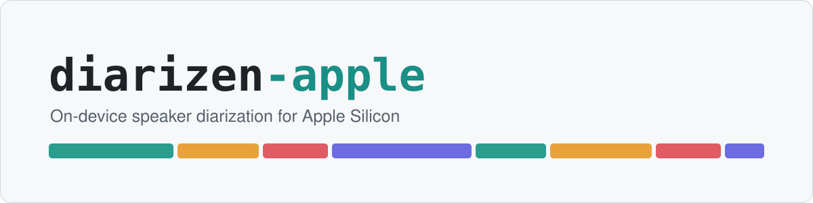
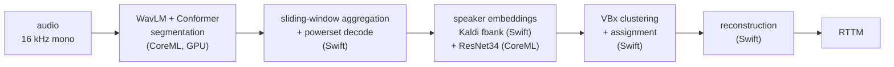

<p align="center">
  <picture>
    <source media="(prefers-color-scheme: dark)" srcset="assets/banner-dark.svg">
    
  </picture>
</p>

<p align="center">
  <a href="LICENSE"></a>
  <a href="MODELS.md"></a>
  
  
  
  <a href="https://github.com/NikiO-INO/diarizen-apple/actions/workflows/ci.yml"></a>
</p>

`diarizen-apple` runs the [DiariZen](https://github.com/BUTSpeechFIT/DiariZen)
speaker-diarization pipeline on Apple Silicon with no Python at inference time.
The two neural stages run in CoreML on the GPU; the audio frontend, aggregation,
and clustering run in native Swift. It reads an audio file and writes standard
RTTM, and it reproduces the upstream pipeline's accuracy.

DiariZen (BUT Speech@FIT) is a strong open-source diarizer: a WavLM front-end
with powerset segmentation and VBx clustering, and it does not cap the number of
speakers. It ships as a PyTorch pipeline. This project makes it run on a Mac,
offline, as a self-contained Swift binary plus CoreML model files.

## Contents

- [Highlights](#highlights)
- [How it works](#how-it-works)
- [Requirements](#requirements)
- [Quick start](#quick-start)
- [Models and licensing](#models-and-licensing)
- [Accuracy and benchmarks](#accuracy-and-benchmarks)
- [Limitations](#limitations)
- [Design notes](#design-notes)
- [Repository layout](#repository-layout)
- [Using it from a host app](#using-it-from-a-host-app)
- [Contributing](#contributing)
- [Acknowledgements](#acknowledgements)
- [Citation](#citation)
- [License](#license)

## Highlights

- Real-time factor of 0.037 on an M2 Pro, about 16 times faster than the PyTorch
  CPU pipeline and a little faster than PyTorch on MPS, using about 300 MB of
  memory (roughly a 25th of PyTorch CPU and a sixth of PyTorch MPS).
- No speaker-count cap. On the full AMI EN2002a meeting the base model scores
  21.16% DER and the large model 17.50%.
- Self-contained at inference: one Swift binary and a few CoreML files, with no
  torch, pyannote, or Python runtime.
- Validated stage by stage against the original pipeline, from the mel frontend
  through clustering, with tolerances recorded in `validation/`.
- One binary for both checkpoints. The powerset geometry is read from the model,
  so `base-s80-md` and `large-s80-md-v2` need no code change.

## How it works



Segmentation labels who speaks in each short window, including overlaps, using a
powerset head. Aggregation slides that window across the audio and stitches the
frame labels together. For every speaker in every window the pipeline computes a
WeSpeaker embedding, from a Kaldi filterbank in Swift and a ResNet34 in CoreML.
VBx then clusters the embeddings into speakers, and reconstruction turns the
per-window labels and cluster assignments back into a single RTTM.

`docs/PIPELINE.md` has the exact tensor shapes and the frame resolution.

## Requirements

- macOS 14 or later on Apple Silicon.
- Xcode 15 or later (Swift 5.9) to build the runtime.
- Python 3.11 with the pinned versions in `requirements.txt`, only to export the
  models and run the parity checks. Inference needs no Python.

## Quick start

Export the CoreML models once with Python, then build and run the Swift binary.

```bash
# 1. Conversion environment (only to produce the CoreML models)
python3.11 -m venv .venv && source .venv/bin/activate
pip install -r requirements.txt

# 2. Export the three CoreML artifacts for a checkpoint into build/coreml/.
#    This downloads the CC BY-NC weights from Hugging Face; accept the license
#    on the model page first.
python conversion/export_coreml.py           --model BUT-FIT/diarizen-wavlm-base-s80-md --out build/coreml
python conversion/export_embedding_coreml.py --model BUT-FIT/diarizen-wavlm-base-s80-md --out build/coreml
python conversion/export_plda.py             --model BUT-FIT/diarizen-wavlm-base-s80-md --out build/coreml/plda_transform.json

# 3. (optional) Check parity against PyTorch
python validation/compare_pytorch_coreml.py  --model BUT-FIT/diarizen-wavlm-base-s80-md --coreml build/coreml

# 4. Build the runtime and diarize a file
swift build -c release
swift run  -c release diarizen-cli path/to/audio.wav --models build/coreml --output out.rttm
```

For `large-s80-md-v2`, export into its own directory (for example
`build/coreml-large`) and pass that with `--models`.

CLI options:

```
diarizen-cli <audio.wav> --models <dir> [--compute-units cpu-gpu|cpu|all|cpu-ane]
                                        [--output <file>]
```

The default compute policy is `cpu-gpu`. The `all` and `cpu-ane` policies route
to the Neural Engine, which deadlocks or runs far slower on this model, so the
CLI warns against them (see [Limitations](#limitations)).

## Models and licensing

The code in this repository is MIT. The DiariZen **model weights** are
**CC BY-NC 4.0**, non-commercial and research use only, a restriction inherited
from the training data. Converted CoreML and ONNX artifacts are derivatives of
those weights and carry the same restriction.

Weights are never committed here. You download the checkpoint yourself under its
license and run the conversion locally. `MODELS.md` lists the checkpoints and
explains the flow in full.

## Accuracy and benchmarks

Measured on an Apple M2 Pro (8P + 4E, 32 GB), macOS 27.0, with the
`base-s80-md` checkpoint. Reproduce with `benchmarks/run.sh`. Model loading is
excluded; timings are median wall-clock over a 30 s clip.

| Backend | total | real-time factor | peak RSS |
|---|---:|---:|---:|
| native CoreML, CPU + GPU (default) | 1.12 s | **0.037** | **298 MB** |
| native CoreML, CPU only | 1.71 s | 0.057 | 1050 MB |
| PyTorch, MPS | 1.43 s | 0.048 | 1832 MB |
| PyTorch, CPU (reference) | 18.04 s | 0.602 | 7474 MB |

Accuracy on the full AMI EN2002a meeting (35.7 min, 4 speakers, single distant
mic) against the human reference, via `validation/eval_ami.py`:

| Model | DER vs reference |
|---|---:|
| `base-s80-md` (this port) | 21.16% |
| DiariZen base (PyTorch) | 21.10% |
| `large-s80-md-v2` (this port) | **17.50%** |

The base port lands 0.06 points from the PyTorch pipeline on this meeting, and
its output differs from PyTorch's by 1.90% DER. The 30 s parity clip reproduces
the upstream RTTM at 0.495% DER. On the full meeting the Swift pipeline runs in
151 s against 3042 s for PyTorch on CPU, about 20 times faster. Full numbers,
per-stage timings, and the honest caveats are in `benchmarks/RESULTS.md`.

## Limitations

- **The Neural Engine is not used.** CoreML's planner places all 643 ops of this
  transformer segmentation model on the GPU or CPU, none on the ANE. The `.all`
  policy (CPU + GPU + ANE) deadlocks the first predict, and `.cpuAndNeuralEngine`
  runs the segmentation about 12 times slower than the GPU. CPU + GPU stays the
  default. The embedding ResNet could use the ANE, but the gain is too small to
  matter. `benchmarks/compute_plan.py` prints the per-op device placement.
- **`large-s80-md-v2` diverges from PyTorch at the tensor level** (about 29% of
  frames flip on the 16-class powerset). This is inherent CoreML numerics, not a
  conversion bug: base shows the same per-layer divergence rate, the correlation
  stays near 0.997 through the last WavLM layer, and FP32 diverges the same as
  FP16. It is tolerated downstream and DER improves, so the model is usable.
  `base-s80-md` stays the tensor-faithful default. `ROADMAP.md` has the analysis.
- **The benchmarks use one 30 s clip and one full meeting on one machine.**
  Longer and more varied audio would give steadier real-time-factor numbers.

## Design notes

- **Two backends, two roles.** CoreML is the production Apple Silicon backend,
  converted directly from PyTorch with `coremltools` (ML Program, FP16 where
  safe). ONNX is a reference and portability backend for bring-up and parity
  checks; it is not the shipped runtime.
- **Modular pipeline.** The neural stages are separate CoreML models. The
  frontend, aggregation, clustering, and reconstruction stay in Swift on the CPU,
  which keeps each stage testable against the original.
- **Parity first.** Golden tensors and test audio with explicit tolerances assert
  Swift fbank against Kaldi, CoreML against PyTorch, and the full pipeline against
  the upstream RTTM. Neural stages use cosine or tolerance checks; deterministic
  stages are bit-exact.
- **MLX backend, later.** A possible future path. It would mean re-implementing
  WavLM and the Conformer, mapping weights, and revalidating.

## Repository layout

```
diarizen-apple/
├── Sources/
│   ├── DiariZen/            Swift library: the CoreML pipeline
│   │   ├── Audio/           decode + 16 kHz mono resampling
│   │   ├── Segmentation/    WavLM + Conformer wrapper, powerset decode
│   │   ├── Embeddings/      Kaldi fbank (vDSP) + ResNet34 wrapper
│   │   └── Clustering/      VBx, AHC, Hungarian, reconstruction
│   └── diarizen-cli/        audio -> RTTM, plus parity dump modes
├── conversion/              PyTorch -> CoreML / ONNX exporters + patches
├── validation/              parity harness (fbank, CoreML, full pipeline, AMI)
├── benchmarks/              RTF / latency / memory, compute plan, energy
├── docs/PIPELINE.md         tensor shapes and frame resolution
└── Tests/                   Swift unit tests
```

## Using it from a host app

`diarizen-cli` takes an audio file and writes an RTTM hypothesis, the same shape
as the other sidecar diarizers. A host app can call it as an external process and
parse the RTTM. The meetlify meeting app uses it this way,
selectable as the "DiariZen" engine, so its no-cap clustering handles meetings
with many speakers that capped models miss.

## Contributing

See [CONTRIBUTING.md](CONTRIBUTING.md) for how to build, test, export models, and
run the parity and benchmark suites, and for the open items that welcome help
(the ANE rewrite, an MLX backend, and large-v2 tensor fidelity).

## Acknowledgements

This is a port. The models and the pipeline design come from other people's work:

- [DiariZen](https://github.com/BUTSpeechFIT/DiariZen) and the VBx clustering,
  BUT Speech@FIT.
- [WavLM](https://github.com/microsoft/unilm/tree/master/wavlm), Microsoft.
- [pyannote.audio](https://github.com/pyannote/pyannote-audio) for the powerset
  segmentation and reconstruction design.
- [WeSpeaker](https://github.com/wenet-e2e/wespeaker) for the ResNet34 embedder.
- Apple's `coremltools` and CoreML for the on-device runtime.

## Citation

If you use this in research, cite the DiariZen paper
([arXiv:2509.26177](https://arxiv.org/abs/2509.26177)) and the upstream WavLM,
pyannote, and WeSpeaker work. This repository is an Apple Silicon port of that
pipeline and does not change the models.

## License

MIT for the code in this repository (see [LICENSE](LICENSE)). The model weights
and any converted artifacts are CC BY-NC 4.0 and are covered separately (see
[MODELS.md](MODELS.md)).
